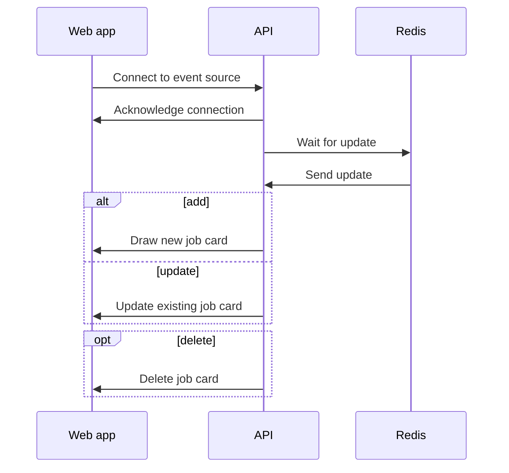
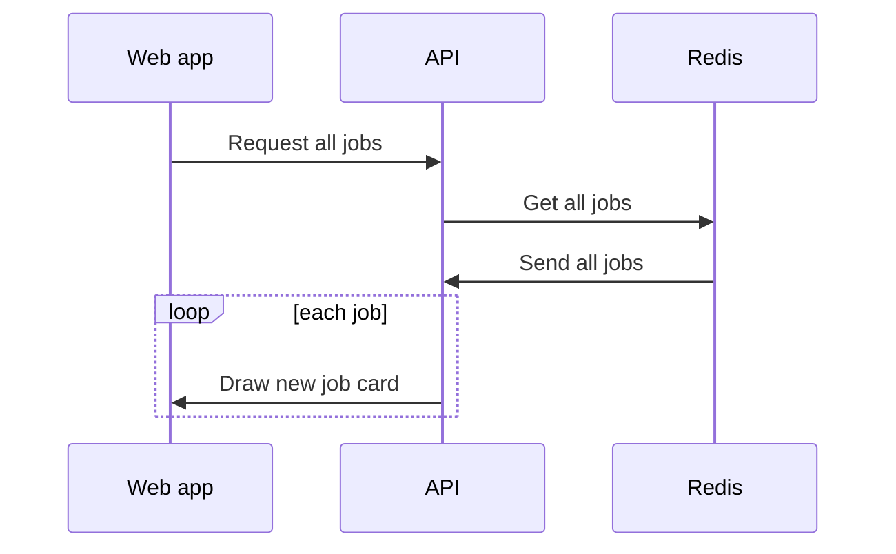
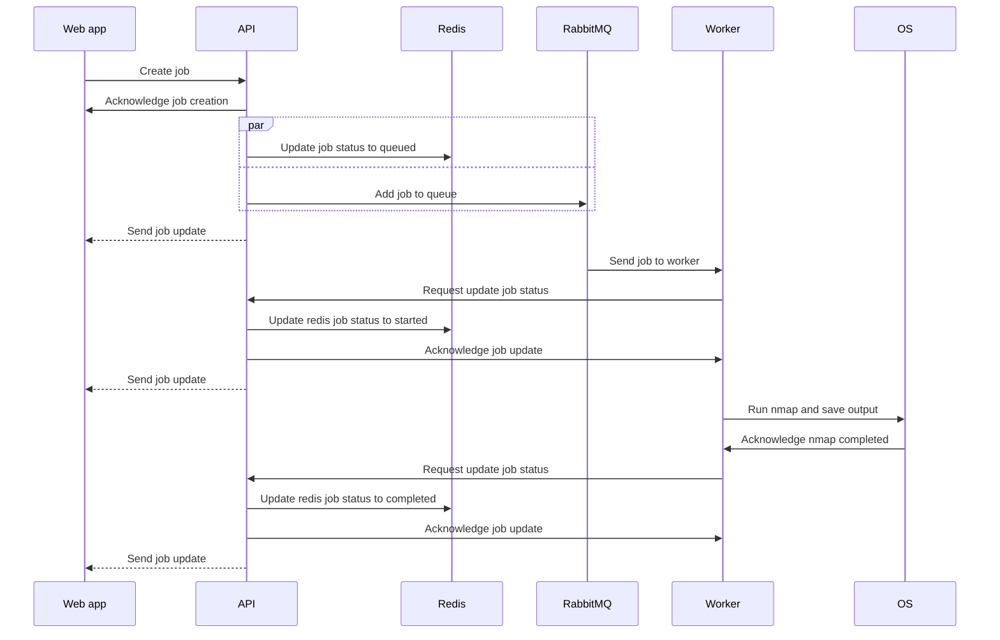
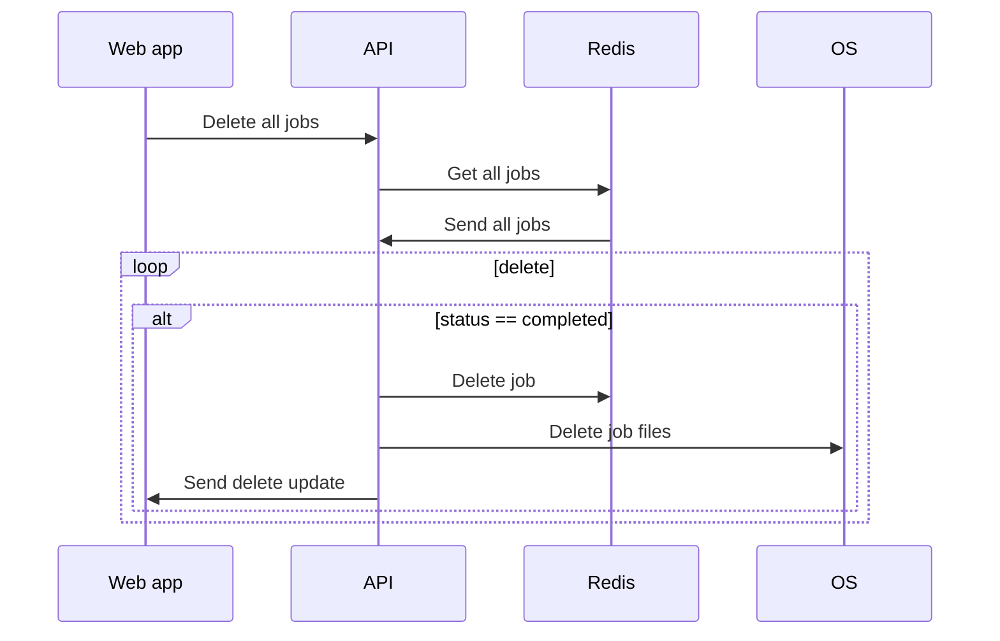
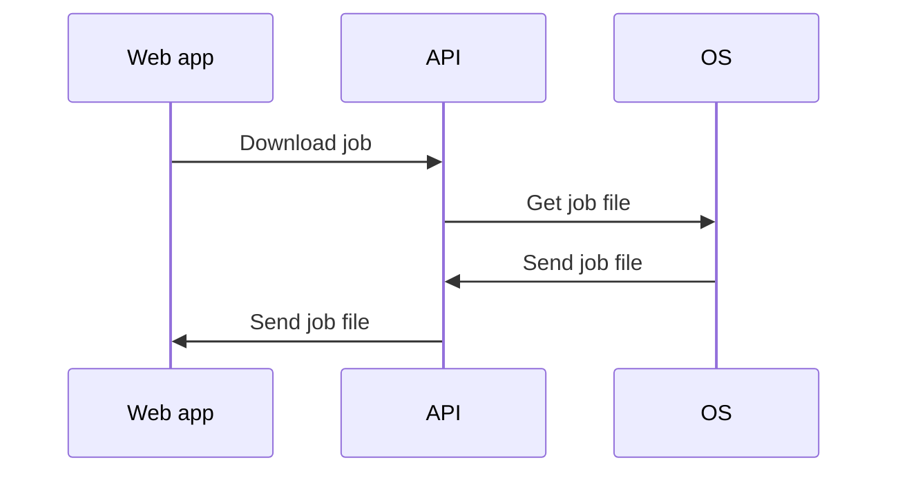

# CovertSwarm

## Docker installation
1. Install docker & docker compose
2. Run the following command to build the docker image
```bash
docker compose up --build
```

## Running a worker
```bash
cd worker
pip install -r requirements.txt
python worker.py
```

## Using the app
1. Open your browser and go to `http://localhost`
2. There will be a option to enter arguments for the nmap commands. Enter the 
arguments and click on the submit button.
3. The status of the scan will be displayed on the screen. Once the scan is
completed, a download link will be displayed to download the scan results.

## Sequence Diagrams

### Event Source


### Request all jobs


### Create job


### Delete all jobs


### Download job


## Future considerations
I would abstract the security checks into it's own lib that can be called from the worker and backend to avoid the duplication of the command line injection checks.

Additionally, saving files to the OS could be easily replaced by an object storage like S3 bucket. This would allow for easier scaling and better performance.

Robust queue connections. Upon the rabbit queue going down the clients will automatically reconnect.